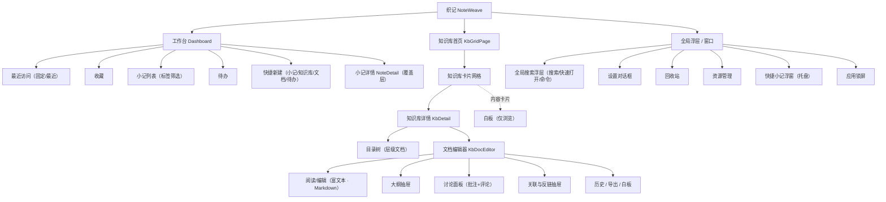
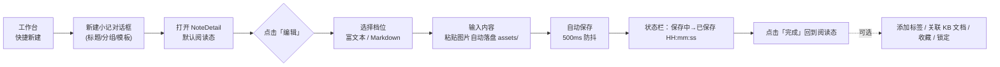
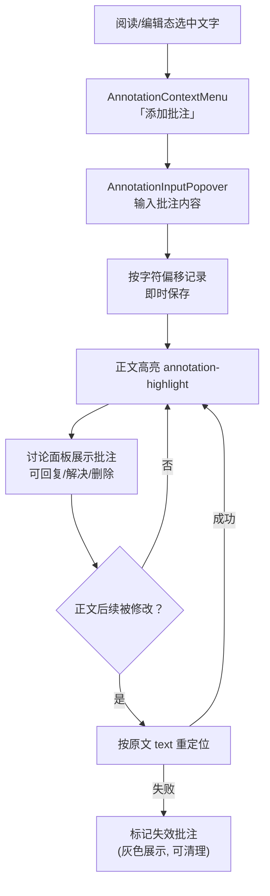
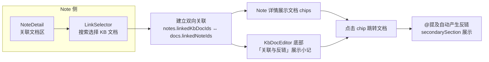
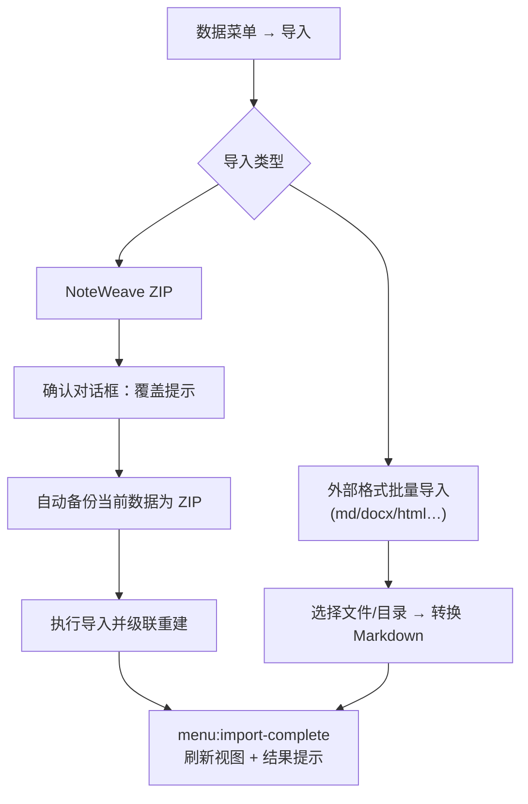
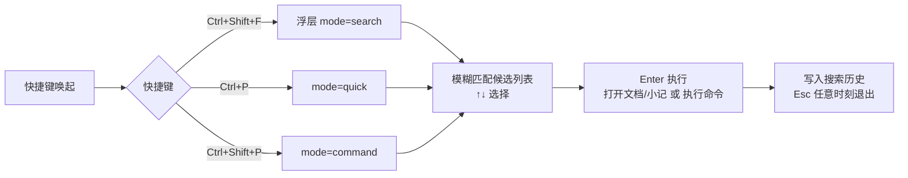
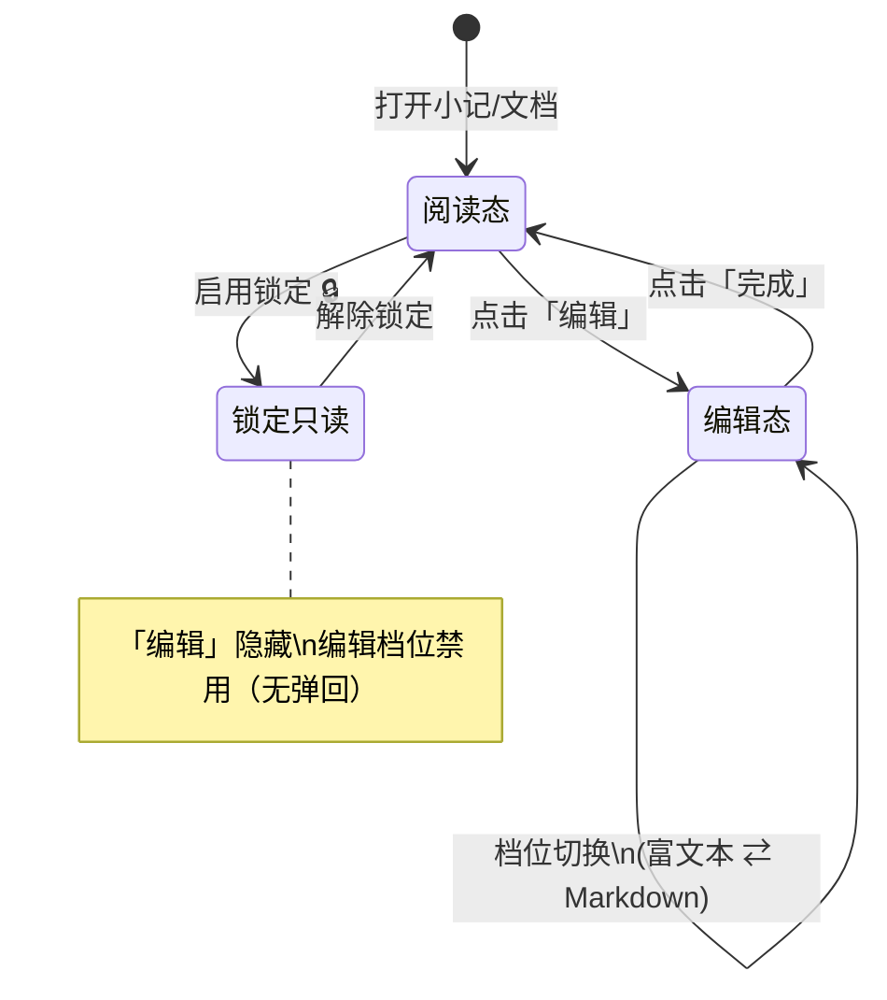
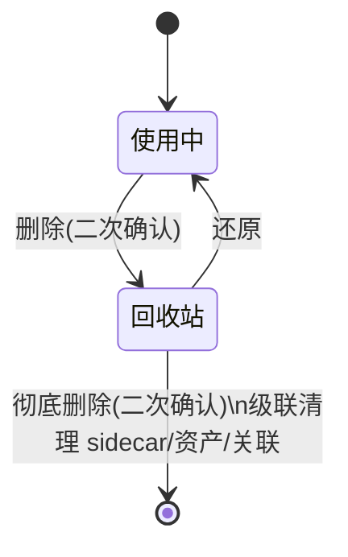
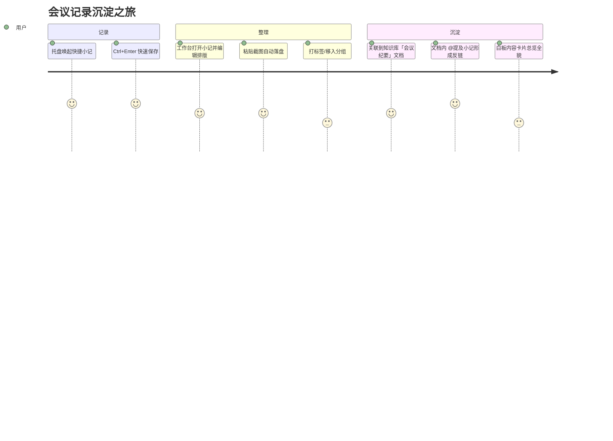

# 织记（NoteWeave） UE 设计文档

> 面向交互/视觉/开发的体验设计说明。架构与数据流见 `docs/DESIGN.md`，操作细节见 `docs/USER_GUIDE.md`。
> 本文档中的流程图使用 Mermaid 绘制，可在应用内的 Markdown 预览中直接渲染。
>
> 🖼 **高保真线框图原型**见 `docs/ue/`（浏览器直接打开 `docs/ue/index.html`，2026-09-05 起视觉语言对齐产品令牌：slate 中性色 + 语雀绿主色、浅色导航轨 + 绿色激活态、lucide 线性图标，参考语雀/Notion 设计语言；图标片段库见 `docs/ue/_icons.md`）：UE-01~10 覆盖工作台、知识库首页/详情、小记详情覆盖层、文档编辑器、白板、全局搜索、快捷小记、锁屏、回收站；UE-11~24 覆盖新建/导出/导入/模板/历史/资源管理/设置对话框与查找替换、大纲标签、AI、思维导图、框架演示、待办等展开态。需求覆盖对照见 `docs/UE_COVERAGE.md`。
>
> 🏷 **实现状态徽标**（2026-08-29 起）：各屏页头标注该屏与实现的关系——✅ 已实现｜🟡 部分实现｜📐 目标态（未实现或差距大）。线框图混合了「描述现状」与「定义目标」两种职能，以徽标为准；逐屏差距明细见 `docs/UE_IMPL_GAP.md`。

## 1. UE 设计目标与原则

### 1.1 体验目标

| 目标 | 说明 |
|------|------|
| 阅读优先 | 打开小记/文档默认进入阅读态，点击「编辑」才进入编辑态，避免误改。 |
| 零负担记录 | 新建即写、自动保存（500ms 防抖），无「保存」按钮，Typora 式无感保存。 |
| 就地可达 | 常用能力（搜索、快速打开、命令、批注、关联）以浮层/抽屉就近展开，不跳页。 |
| 本地安心 | 所有数据本地持久化；删除入回收站、导入前自动备份、危险操作二次确认。 |
| 轻量一致 | 语雀式骨架 + Tailwind 主题变量，light/dark/system 主题一致切换。 |

### 1.2 设计原则

- **单一保存路径**：自动保存是唯一保存路径，状态栏统一反馈 `未保存 → 保存中 → 已保存 HH:mm:ss`。
- **层级克制**：App 一级视图仅「工作台 / 知识库」两个，其余以覆盖层、抽屉、浮层呈现。
- **可逆操作**：删除一律进回收站；编辑有撤销/重做；文档有版本历史可回滚。
- **键盘友好**：全局搜索、快速打开、命令面板、查找替换、链接均有快捷键。

---

## 2. 信息架构（IA）



### 2.1 导航模型

- 左侧 **AppNavRail**（图标导航栏）常驻：顶部品牌区 → 一级入口（工作台 / 知识库）→ 工具区（全局搜索 / 资源管理 / 回收站）→ 底部（主题 / 设置）。
- `main` 区域按状态渲染：默认工作台；点击知识库卡片进入 `KbDetail`；点击小记以**覆盖层**打开 `NoteDetail`（不离开当前上下文）。
- 浮层优先级：锁屏 > 覆盖层（NoteDetail）> 对话框/抽屉 > 页面。

---

## 3. 应用骨架与核心页面线框

### 3.1 整体骨架

```
┌────┬──────────────────────────────────────────────────────────────┐
│ 🏠 │  顶栏：面包屑 / 页面标题                    [搜索][编辑][⋯]   │
│ 📚 ├──────────────────────────────────────────────────────────────┤
│    │                                                              │
│ 🔍 │                  main 内容区                                 │
│ 🗂 │   （Dashboard / KbGridPage / KbDetail / 覆盖层 NoteDetail）  │
│ 🗑 │                                                              │
│    │                                                              │
│ 🌗 │                                                              │
│ ⚙ ├──────────────────────────────────────────────────────────────┤
│    │  StatusBar：字数 · 保存状态(未保存/保存中/已保存) · 档位      │
└────┴──────────────────────────────────────────────────────────────┘
  ▲ AppNavRail（图标导航栏，宽度固定，tooltip 展示名称+快捷键）
```

### 3.2 工作台 Dashboard

```
┌──────────────────────────────────────────────────────────────┐
│  下午好，👋                          今天也要好好记录呀        │
│                                                              │
│  [📝 新建小记] [📚 新建知识库] [📄 新建文档] [✅ 新建待办]     │
│                                                              │
│  ┌ 最近访问 ─┬ 收藏 ─┬ 小记 ─┬ 待办(3) ─┐                     │
│  │ 📌 固定                            │
│  │  ┌───────┐ ┌───────┐ ┌───────┐    │
│  │  │ 卡片  │ │ 卡片  │ │ 卡片  │ …  │
│  │  └───────┘ └───────┘ └───────┘    │
│  │ 🕘 最近                            │
│  │  · 小记标题            10:24       │
│  │  · 文档标题            昨天        │
│  └───────────────────────────────────┘
└──────────────────────────────────────────────────────────────┘
空态：每个 Tab 提供插画文案 + 引导按钮（如「暂无收藏 → 点击星标加入收藏」）
```

交互要点：

- 问候语按时间段变化；快捷新建四枚主按钮为最高视觉权重。
- 「最近访问」分**固定**（卡片网格，可取消固定）与**最近**（列表，按访问时间倒序）。
- 「待办」Tab 显示未完成任务数徽标；「小记」Tab 内嵌标签筛选条。

### 3.3 知识库首页 KbGridPage

```
┌──────────────────────────────────────────────────────────────┐
│  知识库                              [+ 新建知识库] [挂载外部] │
│  ┌─────────┐ ┌─────────┐ ┌─────────┐ ┌─────────┐             │
│  │ 📗 图标  │ │ 📘      │ │ 📙      │ │ ➕      │             │
│  │ 名称     │ │         │ │         │ │ 新建    │             │
│  │ N 篇文档 │ │         │ │         │ │         │             │
│  │ 更新于…  │ │         │ │         │ │         │             │
│  └─────────┘ └─────────┘ └─────────┘ └─────────┘             │
└──────────────────────────────────────────────────────────────┘
```

- 卡片悬停浮现操作（重命名 / 导出 / 删除）；外部知识库卡片带「外部/只读」角标。
- 删除知识库 → 确认对话框（说明级联清理范围）→ 入回收站。

### 3.4 知识库详情 KbDetail

```
┌──────────────────────────────────────────────────────────────┐
│ ← 返回 │ 📗 知识库名称                [搜索库内] [+ 新建文档]  │
├───────────────┬──────────────────────────────────────────────┤
│ 目录树         │                                              │
│ ▸ 📄 快速开始  │            KbDocEditor 文档区                │
│ ▾ 📁 产品方案  │   （阅读态 → DocPageHeader [编辑/完成]）      │
│   ├ 📄 需求池  │                                              │
│   └ 📄 路线图  │   右侧抽屉：大纲 / 讨论(批注+评论)            │
│ ▸ 📄 会议纪要  │   底部抽屉：关联与反链                        │
│ ───────────── │                                              │
│ [+ 新建文档]   │                                              │
└───────────────┴──────────────────────────────────────────────┘
```

- 目录树支持层级/子文档、拖拽排序；节点右键：新建子文档 / 重命名 / 移动 / 删除。
- 思维导图类型文档以专用图标区分，点击进入 `MindmapEditor`。

### 3.5 小记详情 NoteDetail（覆盖层）

```
┌──────────────────────────────────────────────────────────────┐
│ ✕ 关闭 │ 工作台 / 小记 / 标题（面包屑）                        │
├──────────────────────────────────────────────────────────────┤
│  DocPageHeader：标题 · 分组 · 标签 · ☆收藏 🔒锁定 ⋯更多       │
│            [编辑]（阅读态） / [完成]（编辑态）                  │
├──────────────────────────────────────────────────────────────┤
│                                                              │
│               阅读态：Markdown 渲染                            │
│               编辑态：富文本 / Markdown 双档切换              │
│                                                              │
├──────────────────────────────────────────────────────────────┤
│  关联文档（LinkPanel）：↔ 已关联 KB 文档 chips [+ 添加关联]    │
└──────────────────────────────────────────────────────────────┘
```

### 3.6 KB 文档编辑器 KbDocEditor

```
┌──────────────────────────────────────────────────────────────┐
│ 面包屑：知识库 / 目录… / 文档名      [大纲][讨论][关联][⋯更多] │
├───────────────────────────────────────────────┬──────────────┤
│  DocPageHeader                                │  讨论面板     │
│  ─────────────────────────────                │ ┌──────────┐ │
│                                              │ │ 批注列表 │ │
│   正文（阅读/富文本/Markdown）                │ │  💬 n条  │ │
│   · 选中文字 → 批注/高亮/气泡菜单             │ ├──────────┤ │
│   · 图片右键：OCR / 复制 / 另存               │ │ 评论问答 │ │
│                                              │ │ 顶层=问题│ │
│                                              │ │ 回复=答案│ │
│                                              │ └──────────┘ │
├───────────────────────────────────────────────┴──────────────┤
│ ▤ 关联与反链（底部抽屉）：已关联小记 · 反链提及               │
└──────────────────────────────────────────────────────────────┘
```

- 右侧「讨论」面板合并批注（上）与评论（下）；大纲、历史为独立抽屉，互斥展开。
- 编辑档位：`富文本（Milkdown WYSIWYG）/ Markdown（源码）`；锁定时编辑档位禁用。

### 3.7 白板（仅浏览模式）

```
┌──────────────────────────────────────────────────────────────┐
│ 白板 · 文档名                    [↶][↷][源码][演示][导出][⏱][缩放]│
├──────────────────────────────────────────────────────────────┤
│                                                              │
│        ┌便签┐      ┌──框架 1──┐                              │
│        │  │ ╲     │ ▭形状    │        ✏手绘                 │
│        └───┘  ╲___│  →连线   │                              │
│                  └──────────┘      ┌─内容卡片─┐              │
│                                    │ 📄 文档  │→ 点击跳转   │
│                                    └─────────┘              │
│                                          ┌───┐              │
│                          小地图 Minimap  │ ▦ │（右下）       │
│                                          └───┘              │
└──────────────────────────────────────────────────────────────┘
```

- 左键拖拽平移、滚轮缩放；元素不可选中/编辑；内容卡片点击跳转对应小记/文档。
- 框架演示 `FramePresentation` 按框架分页播放，可导出 PDF。

### 3.8 全局搜索浮层 GlobalSearch（三合一）

```
        ┌────────────────────────────────────────────┐
        │ 🔍 [搜索] [快速打开] [命令]    mode 切换     │
        │ ┌────────────────────────────────────────┐ │
        │ │ 输入关键词 / 语法（tag: type: 引号精确）│ │
        │ └────────────────────────────────────────┘ │
        │  ▾ 小记（2）                               │
        │    · 标题 — 命中片段高亮…                   │
        │  ▾ 知识库文档（3）                          │
        │    · 文档名 — 命中片段高亮…（含 OCR 图片）  │
        │  ▾ 命令                                    │
        │    · 切换主题 / 导出数据 / 打开回收站…      │
        └────────────────────────────────────────────┘
        ↑↓ 选择 · Enter 打开 · Esc 关闭
```

- `mode='search'`（Ctrl+Shift+F）全文搜索；`mode='quick'`（Ctrl+P）快速打开；`mode='command'`（Ctrl+Shift+P）命令面板，均支持模糊匹配与搜索历史。

### 3.9 其他关键界面

**快捷小记浮窗（`?quicknote=1`，托盘唤起）**

```
┌──────────────────────────┐
│ ⚡ 快捷小记        [─][✕] │
│ ┌──────────────────────┐ │
│ │ 直接输入，Ctrl+Enter  │ │
│ │ 保存为小记            │ │
│ └──────────────────────┘ │
│ [保存 Ctrl+Enter]         │
└──────────────────────────┘
```

**应用锁屏**：全屏遮罩 + 密码输入框；错误抖动反馈；解锁后回到进入前视图。

**回收站 TrashPanel**：列表（类型图标 / 名称 / 删除时间）+ 行内「还原 / 彻底删除」；彻底删除需二次确认。

---

## 4. 核心用户流程

### 4.1 新建并编辑小记（主路径）



### 4.2 知识库文档批注流程



### 4.3 双向关联流程（Note ↔ KB Doc）



### 4.4 数据导入流程（含安全确认）



### 4.5 快速打开 / 命令面板流程



---

## 5. 关键状态机

### 5.1 阅读 / 编辑态切换



### 5.2 自动保存状态机（`lib/save-state.ts`）

```mermaid
stateDiagram-v2
    [*] --> saved : 初始加载完成
    saved --> unsaved : 用户输入
    unsaved --> saving : 500ms 防抖触发
    saving --> saved : 写入成功\n记录完成时间
    saving --> unsaved : 写入失败/继续输入
    note right of saved : 状态栏显示\n「已保存 HH:mm:ss」
```

### 5.3 回收站流转



---

## 6. 交互规范

### 6.1 全局快捷键

| 快捷键 | 功能 | 作用域 |
|--------|------|--------|
| `Ctrl+Shift+F` | 全局搜索 | 全局 |
| `Ctrl+P` | 快速打开 | 全局 |
| `Ctrl+Shift+P` | 命令面板 | 全局 |
| `Ctrl+F` | 文档内查找替换 | 小记/文档详情（三种编辑模式均支持，WYSIWYG 支持第 N 处定位） |
| `Ctrl+K` | 插入/编辑链接（选区气泡 popover） | WYSIWYG 编辑态 |
| `Ctrl+Enter` | 保存快捷小记 | 快捷小记浮窗 |
| `Ctrl+Z` / `Ctrl+Shift+Z` | 撤销 / 重做 | 白板浏览工具栏、编辑器 |

菜单级功能（主→渲染单向通知）：`menu:quick-open`、`menu:command-palette`、`menu:toggle-focus`（专注模式）、`menu:toggle-typewriter`（打字机模式）、`menu:present`（演示）。

### 6.2 反馈与空态

| 场景 | 反馈策略 |
|------|----------|
| 保存 | 状态栏三态 + 完成时间，无弹窗打扰 |
| 删除 | 一律确认对话框，说明级联影响，删除后入回收站可还原 |
| 导入 | 确认框 + 自动 ZIP 备份 + 完成通知 |
| 空列表 | `EmptyState` 插画文案 + 引导动作（如「打开任意文档后会留下访问记录」） |
| 失效批注 | 正文灰色高亮 + 面板标识，提供清理入口 |
| 外部知识库 | 「只读」角标 + 编辑入口禁用 |
| 锁屏 | 密码错误抖动 + 次数无限制（本地 PBKDF2 校验） |

### 6.3 主题与视觉

- 主题三档：`light / dark / system`（跟随系统），入口在 NavRail 底部；支持自定义主题文件（`themes/`）。
- 颜色统一走 CSS 变量（`--color-muted-foreground` 等），组件不硬编码色值。
- 图标统一 `lucide-react`；关键 CSS 类：`markdown-body`、`annotation-highlight`、`code-block`、`milkdown-editor`。

#### 设计令牌映射（实现基准：`src/renderer/src/index.css`）

线框图不定义视觉值；实现一律使用 `@theme` 块中的 Tailwind 主题令牌（亮色值见 `:root`，暗色见 `html.dark`），禁止硬编码色值。`docs/ue/wireframe.css` 的设计变量（`--wf-*`）镜像下表令牌，仅用于原型演示，不作为实现依据：

| 语义 | 令牌 | 亮色基准值 | 用途 |
|------|------|-----------|------|
| 主背景 | `--color-background` | `#ffffff` | 主内容区 |
| 卡片/浮层 | `--color-surface` | `#ffffff` | 对话框、卡片 |
| 侧栏/面板浅灰 | `--color-surface-2` | `#f7f8fa` | 目录树、面板底 |
| 悬浮层级 | `--color-surface-3` | `#f1f5f9` | 悬停/嵌套层 |
| 正文文字 | `--color-foreground` | `#262626` | — |
| 次要文字 | `--color-muted-foreground` | `#8C8C8C` | meta、placeholder |
| 主强调（语雀绿） | `--color-primary` / `--color-primary-hover` | `#31B97F` / `#2AA671` | 主按钮、激活态 |
| 强调浅底 | `--color-accent-soft` | `#E6F7F0` | 选中/激活背景 |
| 焦点环 | `--color-ring` | `#7FD4AE` | `:focus-visible` 描边 |
| 边框 / 强边框 | `--color-border` / `--color-border-strong` | `#E8EAED` / `#d6dae2` | 分隔线 / 强调分割 |
| 成功 / 警告 / 危险 | `--color-success` / `--color-warning` / `--color-danger`（各含 `-soft` 浅底） | `#16a34a` / `#d97706` / `#dc2626` | 状态反馈 |
| 圆角 | `--radius-sm` / `md` / `lg` / `xl` | 6 / 8 / 14 / 20px | 控件 → 卡片 → 对话框 |
| 阴影 | `--shadow-xs` / `sm` / `md` / `lg` | 低饱和近距离投影 | 浮层层级 |
| 白板画布 | `--color-canvas-bg` / `canvas-dot` / `canvas-grid` | `#f1f5f9` / `#cbd5e1` / `#e2e8f0` | 仅白板 |

字号阶梯：界面基础 `15px`（body）；UI 辅助文字 `11~13px`；Markdown 正文与编辑器 `15.5px`、行高 `1.7`；标题 `1.15 / 1.35 / 1.5rem`（h3 / h2 / h1）。间距走 Tailwind 4px 刻度，不自定义零散像素值。

### 6.4 文案与用语规范（统一口径）

| 场景 | 统一用语 | 避免 |
|------|----------|------|
| 新建入口 | 「新建小记」 | 「新建笔记」 |
| 外部知识库标识 | 「只读」角标 | 仅写「外部」（信息量不足） |
| 保存状态 | 「已保存 HH:mm:ss」（精确到秒） | 只精确到分钟 |
| Ollama 设置项 | 「测试连通」 | 「测试连接」 |
| 删除确认 | 「移入回收站，可还原」+ 级联影响说明 | 「不可撤销」（与回收站可还原叙事冲突） |
| 退出编辑态 | 「✓ 完成」 | 「预览」 |
| 空标题兜底 | 小记「无标题」/ 文档「未命名文档」 | 其他兜底词 |
| 空列表 | 插画文案 + 引导动作 | 无引导的「暂无数据」 |

### 6.5 小窗口适配（最小 1024×700）

线框按 1200×720 绘制；窗口收缩时按以下规则降级，任何情况下不允许页面级横向滚动：

- NavRail 固定 56px，不收缩。
- KbDetail 目录树默认 240px；窗口 < 1100px 时可收起为 40px 图标条。
- KbDocEditor 讨论面板默认 300px 并排挤占；窗口 < 1150px 时改为覆盖式抽屉（浮于正文之上，不挤压编辑区）。
- 对话框宽度取 `min(设计宽, 92vw)`；高度超屏时内容区内部滚动，操作按钮常驻底部。
- 卡片网格（知识库卡片 / 固定卡片 / 资源网格）按 `auto-fill, minmax(220px, 1fr)` 自适应列数。
- StatusBar 信息优先级：保存状态 > 字数 > 其他；空间不足时从右侧次要项开始隐藏。

### 6.6 无障碍与键盘可达

- 全功能键盘可达：浮层/抽屉打开后焦点圈定（focus trap），Esc 关闭并把焦点归还给触发元素。
- 纯图标按钮必须有 `aria-label` 与 tooltip（NavRail 已有此规范）。
- 文字对比度：正文 ≥ 4.5:1，次要文字与大标题 ≥ 3:1；暗色主题同标准（以 §6.3 令牌组合为准）。
- 焦点可见：`:focus-visible` 统一 `var(--color-ring)` 描边，不得 `outline: none` 后无替代样式。
- 状态不只靠颜色传达：保存状态有文字、失效批注有「失效」标识、外部库有「只读」文字角标。
- 校验反馈（如锁屏密码错误）除抖动动画外必须有文字提示；动效仅作增强。

---

## 7. 用户旅程地图

### 7.1 旅程一：会议记录 → 沉淀进知识库



**痛点与机会**：从「快捷小记」到「知识库沉淀」需手动关联 → 机会点：快捷小记保存时推荐目标知识库。

### 7.2 旅程二：文档评审与批注闭环


**痛点与机会**：正文修改后批注可能失效 → 已提供按原文重定位与失效标记；机会点：失效批注一键修复建议。

---

## 8. 待优化清单（UE Backlog）

> 优先级口径：P0 = 核心路径功能缺失，设计为目标态；P1 = 形态/结构重设计；P2 = 体验增强。逐项实现差距明细见 `docs/UE_IMPL_GAP.md`。

| # | 事项 | 价值 | 优先级 | 现状 |
|---|------|------|--------|------|
| 1 | UE-05 编辑态讨论面板 + 编辑态批注创建入口 | 编辑器核心体验闭环 | P0 | 📐 目标态未实现（当前编辑态不渲染讨论面板） |
| 2 | UE-24 Todo 优先级/截止时间全链路（数据模型 → IPC → UI） | 待办可用性 | P0 | 📐 全链路缺失 |
| 3 | 白板便签「转待办」（REQ-226 决策：保留设计、补实现） | 白板 → 执行闭环 | P0 | 📐 全链路未实现；原「数据层保留」表述已修正（2026-08-29） |
| 4 | UE-13 导入三步向导 + UE-14 多库批量导出 | 数据迁移安全 | P0 | 📐 目标态未实现（现为导入后报告 / 单库导出） |
| 5 | UE-17 资源管理整页重设计（引用状态字段需主进程配合） | 资产可管理、防误删 | P1 | 现为 Modal 文字列表，「仅未引用可删」保护未实现 |
| 6 | UE-18 设置分区化剩余项（左侧导航 / 主题三档 / 字号 / 默认档位） | 设置可发现性 | P1 | 数据/关于分区已落地（2026-08-27） |
| 7 | UE-03 KB 顶栏三件套 + 目录树右键/拖拽排序 | 库内导航效率 | P1 | 返回/库内搜索/新建主按钮缺 |
| 8 | 快捷小记 → 知识库的引导关联 | 缩短沉淀路径 | P2 | 需手动关联 |
| 9 | 失效批注修复建议 | 保持批注可信度 | P2 | 仅标记失效 |
| 10 | 小窗口适配与无障碍落地（§6.5 / §6.6） | 覆盖面与可达性 | P2 | 桌面优先，规范已补（2026-08-29） |

> 白板「仅浏览模式」为既定裁剪决策，保持不变：编辑类入口勿加回；数据层与渲染能力保留（见 §3.7 与 `AGENTS.md` §11）。
