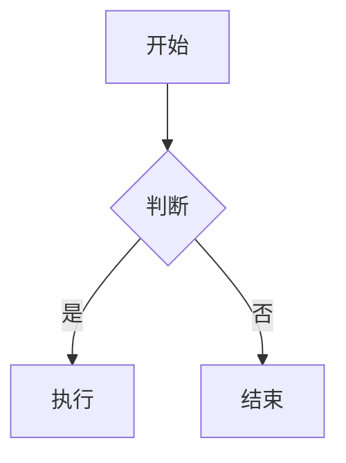

# 织记（NoteWeave） 用户使用手册

## 1. 快速开始

### 1.1 安装

1. 下载 `NoteWeave Setup 1.0.0.exe` 安装程序。
2. 双击运行安装程序，按向导完成安装。
3. 安装完成后，从开始菜单或桌面快捷方式启动应用。

或直接使用便携版：

1. 下载 `NoteWeave-1.0.0-portable.exe`。
2. 复制到任意目录（如 U 盘）。
3. 双击即可运行，无需安装。

### 1.2 启动界面

启动后，应用主界面分为左右两部分：

- **左侧边栏**：显示所有提示/待办任务列表。
- **右侧详情区**：显示当前选中任务的详细内容。

首次打开时，右侧显示空状态提示，点击左侧“新建”即可创建第一个任务。

---

## 2. 创建提示任务

### 2.1 新建任务

点击左侧边栏顶部的 **“新建”** 按钮：

1. 列表中新增一个“无标题”任务。
2. 右侧自动打开详情编辑界面。
3. 光标定位在标题输入框，可直接输入。

### 2.2 编写标题

标题框支持 **Markdown 内联语法**，例如：

```markdown
**重要** 周会
`代码 review`
[外部链接](https://example.com)
~~已取消~~
```

在任务列表中，标题会渲染为对应的 Markdown 样式。

> 标题目前仅支持内联 Markdown，不支持大标题、列表等块级元素。

### 2.3 编写任务详情

详情编辑器支持完整 Markdown，包括：

- 标题：`#`, `##`, `###`
- 加粗/斜体/删除线：`**bold**`, `*italic*`, `~~del~~`
- 列表：有序列表、无序列表、任务列表
- 代码块与行内代码
- 引用块
- 表格
- 链接与图片
- 分隔线
- **数学公式**（LaTeX）：`$E=mc^2$`（行内）、`$$...$$`（块级）
- **Mermaid 图表**：` ```mermaid ` 代码块

### 2.4 编辑器模式

提示任务详情与知识库文档均采用「阅读优先」：打开后为只读阅读态，点击页头「编辑」进入编辑态（再点「完成」回到阅读态）。编辑态下通过顶部「富文本 / Markdown」切换器在两档编辑模式间切换：

| 模式 | 说明 |
|------|------|
| **富文本**（WYSIWYG） | 所见即所得，输入 Markdown 标记后立即渲染为对应样式（基于 Milkdown）。**新建文档默认采用此模式**。 |
| **Markdown** | Markdown 源码编辑（双栏实时预览），适合熟悉 Markdown 的用户。 |

- 模式切换不会丢失未保存的内容（当前内容已实时写回）。
- 切换后的模式会被记住，下次新建文档时自动沿用。
- 知识库文档的批注、评论功能在阅读态下使用。

**富文本（WYSIWYG）模式增强能力：**

- **斜杠命令**：在空行输入 `/` 会弹出命令菜单，可快速插入一级/二级/三级标题、无序列表、有序列表、待办列表、引用、代码块、分割线、表格、数学公式、Mermaid 图表等。用 ↑/↓ 选择，Enter 插入，Esc 取消。
- **公式编辑**：输入 `$...$`（行内）或 `$$...$$`（块级）后即时渲染为公式；单击公式可编辑源码，Ctrl+Enter 或失焦后写回。
- **图表编辑**：插入 Mermaid 图表后实时渲染为 SVG；双击图表进入源码编辑，Ctrl+Enter 或失焦后写回。
- **快捷键**：`Ctrl+B` 加粗、`Ctrl+I` 斜体、`Ctrl+K` 为选中文本添加链接（弹窗输入 URL）。

> 公式与图表在富文本模式与阅读态下渲染效果一致；切换编辑模式不会丢失内容。

---

## 3. 查看任务

### 3.1 列表视图

左侧列表展示：

- **标题**：渲染后的 Markdown 标题。
- **摘要**：内容前 120 字符的纯文本摘要。
- **更新时间**：相对时间，如“5 分钟前”、“2 小时前”。

### 3.2 详情视图

点击列表中的任意任务，右侧显示该任务的完整内容：

- 标题编辑/预览区
- 详情编辑/预览区
- 顶部工具栏：「编辑/完成」切换、编辑器模式切换（富文本 / Markdown）、更新时间、删除

### 3.3 阅读态与编辑态

打开任务后默认为**阅读态**，只显示渲染后的 Markdown 内容（包括公式、图表、代码高亮）。点击页头 **“编辑”** 进入编辑态，编辑完成后点击 **“完成”** 回到阅读态。

---

## 4. 编辑与保存

### 4.1 自动保存

织记（NoteWeave） 会自动保存你的修改：

- 停止输入 **500 毫秒** 后自动保存到本地。
- 保存成功后，左侧列表的摘要和时间会自动更新。

### 4.2 立即保存

自动保存是唯一保存路径，界面没有独立的保存按钮。如需立即落盘，可使用菜单「文件 → 保存」或快捷键 `Ctrl+S`；底部状态栏会实时显示保存状态（未保存/保存中/已保存 + 完成时间）。

### 4.3 切换任务

编辑过程中切换到其他任务：

- 当前任务的自动保存会立即触发。
- 然后加载新选中的任务内容。

---

## 5. 删除任务

### 5.1 从列表删除

将鼠标悬停在列表项上，右侧会出现垃圾桶图标，点击即可删除。

### 5.2 从详情区删除

点击详情区顶部的 **“删除”** 按钮。

### 5.3 删除确认

删除操作会弹出确认对话框，点击“确定”后才会真正删除。删除后文件会从本地移除，无法恢复。

---

## 6. 知识库文档批注

在知识库文档（KB Doc）的**阅读态**下，可以对正文内容添加批注。

### 6.1 添加批注

1. 打开一篇知识库文档，确保处于**阅读态**（编辑态下点击页头「完成」回到阅读态）。
2. 用鼠标选中一段**同一段落内的纯文本**。
3. **右键** → 选择「添加批注」。
4. 在弹窗中填写批注内容，点击「确定」（内容为空时不可提交）。

选中的原文会以**黄色高亮**显示，右侧批注面板同步出现该条批注。

> **选择限制**：第一版仅支持同一段落内的连续纯文本。跨段落、跨列表项，或选中包含 Markdown 符号（如 `**粗体**`）的片段时，右键菜单会禁用并提示「请在同一段落内选择纯文本」。

### 6.2 批注面板

文档预览区右侧为批注面板：

- 列表按批注在文档中出现的先后顺序排列。
- 每条显示选中原文摘要、批注内容、更新时间。
- **点击**某条批注，文档会自动滚动并定位到对应高亮位置。
- 鼠标悬停显示「编辑」「删除」按钮。

### 6.3 编辑与删除

- **编辑**：再次选中已有批注的高亮文本 → 右键「编辑批注」；或在面板点击「编辑」。仅可修改批注文字，不能改关联的高亮范围（换范围需先删除再重新添加）。
- **删除**：批注内容非空时点击「删除」会弹出确认；空批注直接删除。

### 6.4 文档修改后的定位

文档内容被编辑后，原先批注记录的字符位置可能失效：

- 若原文片段仍能找到 → 自动重新高亮，面板标注「⚠ 位置可能已变动」。
- 若原文已被改写无法匹配 → 该条不再高亮，面板条目置灰并标注「原文已修改，定位失效」。批注记录仍保留，可手动删除或重新添加。

### 6.5 列表标识

知识库文档列表项会显示该文档的批注数量（如「3 条批注」）。

---

## 7. 数据存储

### 7.1 存储位置

应用数据与程序保存在同一目录下，便于备份和迁移：

- **安装版 / 便携版**：数据保存在 `NoteWeave.exe` 所在目录下的 `data\` 文件夹：

  ```
  <安装目录>\data\notes\              # 提示任务
  <安装目录>\data\knowledge-bases\    # 知识库及其文档、白板
  ```

- **开发模式**：数据保存在项目根目录下的 `dev-data\`。

每个任务对应一个 JSON 文件，文件名格式为 `{任务ID}.json`。

> 提示：便携版（`NoteWeave-1.0.0-portable.exe`）的数据默认跟随 exe 所在目录，把整个文件夹拷贝到 U 盘或另一台电脑即可直接使用。

### 7.2 备份数据

你可以直接复制数据目录进行备份：

1. 关闭 织记（NoteWeave）。
2. 复制 exe 所在目录下的整个 `data` 文件夹到安全位置（如另一个磁盘或网盘）。
3. 需要恢复时，关闭应用后用备份覆盖回 `<安装目录>\data\`。

> 也可以使用顶部「数据工具」按钮 →「导出所有数据（全量备份）」生成一个 ZIP 备份包。该包包含**全部 10 类数据**：提示任务、知识库、资源附件、待办、版本历史、回收站、自定义模板、自定义主题、外部知识库扩展数据、OCR 缓存，以及应用设置（`settings.json`）。还原时通过「导入数据（还原备份）」即可，导入前会自动对当前数据再做一次全量备份。

### 7.3 迁移数据到新电脑

1. 在原电脑上找到 `NoteWeave.exe` 所在目录，复制其下的整个 `data` 文件夹。
2. 在新电脑安装并运行一次 织记（NoteWeave）（自动生成目录）。
3. 关闭应用，用备份的 `data` 文件夹覆盖新电脑安装目录下的同名 `data` 文件夹。

> 便携版用户更简单：直接把整个应用文件夹（含 exe 与 `data\`）拷到新电脑即可运行，无需额外步骤。

### 7.4 软件升级与数据保留

便携版/安装版升级时，数据目录（`data\`）与程序目录分离，只要不覆盖 `data\` 文件夹即可保留全部历史数据。推荐两种方式：

**方式 A：直接替换程序文件（最简单）**

1. 关闭正在运行的 织记（NoteWeave）。
2. 解压新版本到**独立目录**（不要直接覆盖旧目录）。
3. 将旧目录下的整个 `data\` 文件夹复制到新版本的 exe 同级目录。
4. 启动新版本，所有笔记/知识库/设置/历史/回收站/模板/主题均会保留。
   - 启动时控制台会打印 `[NoteWeave] 数据目录：...`，可据此确认数据落点正确。

**方式 B：用全量备份还原（最稳妥，建议升级前先做一次）**

1. 在旧版本中执行「导出所有数据（全量备份）」，得到一个 ZIP 文件。
2. 解压并运行新版本。
3. 在新版本中执行「导入数据（还原备份）」选择该 ZIP。
   - 导入前会自动对当前数据再做一次备份，无需担心覆盖丢失。
4. 还原后建议重启应用，使主题/编辑器模式等设置完全生效。

> 注意：外部知识库的 `.md` 正文文件存放在你指定的外部文件夹中，不在 `data\` 内，全量备份**不包含**外部文件夹本身；升级后只需确保外部文件夹路径不变，外部知识库即可正常访问，其批注/白板等扩展数据会随备份一并保留。

---

## 8. 快捷键

| 快捷键 | 功能 |
|--------|------|
| `Ctrl + N` | 新建任务（预留，后续版本支持） |
| `Ctrl + S` | 立即保存当前任务（预留，后续版本支持） |
| `Ctrl + Delete` | 删除当前任务（预留，后续版本支持） |

> 当前版本主要通过鼠标和自动保存交互，快捷键将在后续版本补充。

---

## 9. Markdown 语法参考

### 9.1 常用语法速查

| 效果 | 语法 |
|------|------|
| 一级标题 | `# 标题` |
| 二级标题 | `## 标题` |
| 加粗 | `**文字**` |
| 斜体 | `*文字*` |
| 删除线 | `~~文字~~` |
| 行内代码 | `` `代码` `` |
| 代码块 | ` ``` 代码 ``` ` |
| 无序列表 | `- 项目` |
| 有序列表 | `1. 项目` |
| 任务列表 | `- [ ] 待办` / `- [x] 已完成` |
| 引用 | `> 引用内容` |
| 链接 | `[显示文字](https://...)` |
| 图片 | `` |
| 表格 | `\| 表头 \| 表头 \|` |
| 分隔线 | `---` |

### 9.2 任务清单示例

```markdown
## 今日待办

- [x] 查看邮件
- [ ] 完成项目文档
- [ ] 下午 3 点参加会议
```

### 9.3 表格示例

```markdown
| 任务 | 优先级 | 状态 |
|------|--------|------|
| 需求评审 | 高 | 已完成 |
| 代码开发 | 高 | 进行中 |
| 测试用例 | 中 | 未开始 |
```

### 9.4 数学公式（LaTeX）

织记 使用 KaTeX 渲染数学公式，语法基于 LaTeX。

**行内公式**（用单个 `$` 包裹）：

```markdown
质能方程 $E=mc^2$ 是爱因斯坦提出的。
```

**块级公式**（用 `$$` 包裹）：

```markdown
$$
\int_{a}^{b} f(x)\,dx = F(b) - F(a)
$$
```

支持矩阵、分段函数、求和、希腊字母等复杂公式，无需联网即可渲染（本地 KaTeX 资源）。

### 9.5 Mermaid 图表

将代码块的语言标记为 `mermaid`，即可渲染流程图、时序图、甘特图、类图、状态图、饼图等：

````markdown

````

图表渲染失败（如语法错误）时会显示原始代码与错误提示，便于修正。

### 9.6 代码块

代码块支持 50+ 编程语言语法高亮。每个代码块右上角显示语言标签并提供「复制」按钮，一键复制全部内容。

````markdown
```ts
function greet(name: string): string {
  return `你好，${name}！`
}
```
````

> 行号显示可在「设置」中开启（默认关闭）。

---

---

## 10. 常见问题

### Q1：数据会丢失吗？

不会。数据自动保存到本地 JSON 文件，关闭应用后仍然存在。

### Q2：可以离线使用吗？

可以。织记（NoteWeave） 完全本地运行，无需联网。

### Q3：如何更换电脑保留数据？

参考本文 [7.3 迁移数据到新电脑](#73-迁移数据到新电脑)。

### Q4：标题为什么不能显示大标题？

标题字段设计为内联 Markdown，只支持粗体、斜体、代码、链接、删除线等行内样式。如需大标题，请写在任务详情中。

### Q5：应用崩溃后数据还在吗？

在。只要自动保存已经触发过，数据就会写入本地文件。崩溃可能导致最近一次输入未保存，建议养成手动保存习惯。

### Q6：能否同时打开多个窗口？

当前版本为单窗口应用。如需多窗口，请关注后续版本更新。

---

## 11. 故障排除

### 11.1 应用无法启动

1. 检查 Windows 版本是否支持（建议 Windows 10/11）。
2. 尝试右键点击 exe → “以管理员身份运行”。
3. 检查杀毒软件是否误拦截。

### 11.2 列表空白但之前有新数据

1. 检查数据目录是否存在：`<安装目录>\data\notes\`（开发模式为 `<项目根目录>\dev-data\notes\`）。
2. 确认 JSON 文件是否被移动或删除。
3. 尝试重新启动应用。

### 11.3 Markdown 预览显示异常

1. 检查语法是否正确（如表格需要表头分隔线）。
2. 标题字段不支持块级 Markdown，详情字段才支持。

---

## 12. 反馈与支持

如遇到问题或有新功能建议，欢迎提交反馈。

---

## 13. 进阶功能（v1.1）

### 13.1 主题与暗色模式

点击左侧边栏头部的太阳/月亮图标，在「亮色 / 暗色 / 跟随系统」之间切换。选择会自动记住，下次启动保持。

### 13.2 知识库文档层级目录

- 在知识库文档列表中，将一篇文档**拖到另一篇文档上**即可作为其子文档；拖到底部「拖到此处变为顶层文档」可恢复为顶层。
- 鼠标悬停在文档项上，点击 **＋** 可在其下新建子文档。
- 删除含子文档的父文档时会提示是否一并删除全部子孙文档。

### 13.3 文档大纲

在知识文档阅读态下，点击工具栏「大纲」可在右侧显示目录。点击条目跳转，滚动时自动高亮当前章节。

### 13.4 图片与附件

- 在文档/任务详情编辑器中 **Ctrl+V** 可直接粘贴截图（自动保存到本地数据目录）。
- 从文件管理器**拖拽**图片或文件（PDF、Word 等）到编辑器即可插入：图片显示为图片，其他文件显示为可点击的附件链接。
- 图片/附件以 `noteweave-asset://` 协议引用，不暴露系统绝对路径。
- **右键点击图片**可弹出菜单：复制图片到剪贴板、用系统默认看图程序查看原图、在系统文件夹中定位该图片、或删除图片（删除会同时移除文档中的引用并删除文件）。
- 删除含图片的文档/提示任务时，会检测「仅被该文档引用」的图片并提示是否一并清理，避免产生孤儿资源。

### 13.5 全文搜索

按 **Ctrl+Shift+F**（或点击侧栏搜索图标）打开全局搜索。可搜索提示任务、知识文档、待办、批注，并按类型筛选；支持按**更新时间范围**筛选，可在「时间 / 相关度」之间切换排序；点击结果直接跳转，并自动定位到匹配关键词。

### 13.6 单文档导出

在知识文档工具栏点击「导出」，可将当前文档导出为 **PDF / HTML / Word（兼容）**。导出文件名默认取文档名，图片会内联到文件中保证离线可见。菜单中的「包含批注」勾选项（默认开启）可把文档的批注作为段落附加到导出文件末尾。

### 13.7 资源管理

通过侧栏「更多 → 资源管理」打开。可查看所有图片/附件（按归属分组），逐个删除，或一键**清理未被任何文档引用的资源**。导出 ZIP 时图片/附件会一并打包，导入时自动还原。

### 13.8 标签

- 在文档标题下方或提示任务详情的「标签」栏输入文字，按 **回车** 添加标签；标签旁的 × 可删除。输入时会基于已有标签自动补全。标签会随搜索索引一起被检索。
- 列表项会展示前两个标签胶囊；侧边栏顶部的「按标签筛选」可点击某个标签快速筛选出所有带该标签的提示任务。

### 13.9 批注回复（讨论流）

在批注面板中，每条批注下方可输入回复（回车发送），形成讨论流；悬停回复可删除。

### 13.10 文档模板

- 新建顶层文档时会弹出模板选择器，可从内置模板（会议纪要、需求文档、周报、读书笔记、项目方案、空白）或自定义模板创建。
- 在文档工具栏点击「存为模板」可将当前文档保存为自定义模板。

### 13.11 回收站

通过侧栏「更多 → 回收站」打开。可恢复误删的提示任务 / 知识文档 / 知识库。删除知识库时其下文档会一并进入回收站；恢复整个知识库时会**自动级联恢复**其下全部文档内容，无需逐条操作。

### 13.12 版本历史

在知识文档工具栏点击「历史」打开版本历史面板。每次保存（内容有变化时）自动生成快照，可预览任意版本。除「与当前对比」外，还可在版本列表中点击「设为对比基准」，选中基准与另一版本时切换为**两个历史版本之间的对比**（绿色=右侧新增，红色=右侧已删），并可「恢复此版本」（数量上限可在设置 `maxHistoryVersions` 中调整，默认 30）。

---

# 14. v1.2 新增功能

v1.2 聚焦补齐 Typora 同级的写作与导出体验。

## 14.1 文档内查找与替换（Ctrl+F / Ctrl+H）

在知识文档编辑器中按 `Ctrl+F` 打开查找浮层，`Ctrl+H` 切换为替换。支持正则表达式、区分大小写、全字匹配；支持替换当前与全部替换。WYSIWYG 与源码/即时模式均可用。

## 14.2 字数统计状态栏

编辑器底部状态栏实时显示字数（中文按字符、英文按单词）、字符数、段落数与阅读时间估算；选中文字时额外显示「已选 X 字」。点击字数可切换显示模式。

## 14.3 YAML Front Matter

文档顶部可写入 `---...---` YAML 元数据块（title/tags/date/categories 等）。Front Matter 不会被渲染为正文，编辑器顶部以卡片形式只读展示，切换编辑模式不丢失，Markdown 导出保留原文。

## 14.4 脚注

支持 `[^1]` 行内引用与 `[^1]: 内容` 底部定义语法，预览端渲染为上标编号与脚注列表，导出 HTML/PDF 保留脚注。斜杠命令提供「脚注」快速插入。

## 14.5 增强型表格

WYSIWYG 模式下选中表格单元格时显示浮动工具栏：上方/下方插入行、左侧/右侧插入列、删除行列、左/中/右对齐。`Tab`/`Shift+Tab` 在单元格间导航（由 Milkdown 内置 keymap 提供）。

## 14.6 扩展内联标记

支持 `==高亮==`、`++下划线++`、`^上标^`、`~下标~`（单波浪号；双波浪号 `~~` 仍为删除线），在编辑/预览/导出三端一致渲染，斜杠命令可快速插入。

## 14.7 Focus / Typewriter 模式

- Focus 模式（`F11` 或视图菜单）：淡化非当前段落，专注写作。
- 打字机模式（`Ctrl+Shift+T`）：当前编辑行保持在视口中部。

## 14.8 命令面板（Ctrl+Shift+P）

搜索并执行命令（切换模式/导出/插入元素/打开回收站/切换主题/查找/演示等），最近使用置顶。

## 14.9 快速打开（Ctrl+P）

按标题模糊匹配便签与知识文档，回车打开。

## 14.10 最近 / 固定文件

侧栏顶部「最近/固定」分组自动记录最近 20 个打开项；右键可固定到顶部，固定项重启后保留。

## 14.11 自定义主题与 CSS

侧栏「更多 → 设置 → 主题」选择内置或自定义主题。自定义主题 CSS 放在应用数据目录 `themes/` 文件夹（`.json` 文件，含 `name`/`css`/`isDark` 字段），覆盖 `--nw-*` CSS 变量与 `.markdown-body` 样式。

## 14.12 扩展导出格式

导出菜单新增：Markdown（含 Front Matter）、纯文本、RTF、OPML 大纲、LaTeX、EPUB（保留原有 PDF/HTML/Word）。

## 14.13 拼写检查 / 自动配对

设置中开关。拼写检查对英文生效（系统词典）；自动配对输入成对符号、选区包裹。

## 14.14 更多图表类型（PlantUML / Graphviz）

代码块语言标记为 `plantuml` 或 `dot` 即可渲染。Graphviz 使用纯 WASM 本地渲染；PlantUML 需在设置中开启本地服务并安装 Java（随应用分发 plantuml.jar）。

## 14.15 演示 / 幻灯片模式

知识文档工具栏「演示」按钮或命令面板进入，按 H1/H2 分页全屏展示，方向键翻页，Esc 退出。

## 14.16 多窗口

`Ctrl+Shift+N`（窗口菜单）新建应用窗口，每个窗口可独立打开不同文档。

## 14.17 Markdown Lint

设置中开启后，编辑器右侧显示 Lint 面板，列出标题层级跳跃、行尾空格、无 alt 图片等问题（基于 markdownlint 标准规则）。

## 14.18 Pandoc 集成

系统安装 Pandoc 后可检测到，用于更高质量的导出（未来扩展）。

## 14.19 打开本地文件夹作为知识库

新建知识库对话框或文件菜单「打开本地文件夹作为知识库」：选择磁盘文件夹挂载为外部知识库，子文件夹映射为文档层级，编辑保存写回原 .md 文件，外部修改可刷新。

## 14.20 补充说明（v1.2 修订）

- **REQ-103 标签双向同步**：编辑标签会自动写回文档 Front Matter 的 `tags` 字段；若文档 Front Matter 含 `tags`，会自动回填到列表筛选用的标签系统。
- **REQ-104 脚注点击**：编辑/阅读态点击 `[^id]` 上标编号可平滑滚动到文档底部的脚注定义。
- **REQ-105 合并/拆分单元格**：在表格中拖选多个单元格后，浮动工具栏「合并」按钮可用；光标位于已合并单元格时「拆分」按钮可用（合并/拆分由 ProseMirror 表格引擎处理）。
- **REQ-111 导出主题**：导出菜单可选择「应用当前」或指定内置/自定义主题，导出 HTML/PDF/Word 时注入对应 CSS。
- **REQ-115 PlantUML 本地化**：Graphviz 使用纯 WASM 本地渲染（无外部依赖）；PlantUML 需用户在设置中开启本地服务、安装 Java，并将 `plantuml.jar` 放入应用数据目录或开发目录 `buildResources/`（生产打包需取消注释 `electron-builder.yml` 的 extraResources）。
- **REQ-119 Pandoc 导出**：系统安装 Pandoc 后导出菜单出现「使用 Pandoc」选项，启用后委托 Pandoc CLI 生成 docx/epub/latex/rtf/html/pdf。

## 14.21 PlantUML 本地化说明（v1.2 修订）

PlantUML 代码块（```plantuml）使用**内置纯 JS 本地渲染器**，无需安装 Java 或下载 plantuml.jar，开箱即用：
- 支持序列图（参与者、消息箭头、自调用、note）
- 支持类图（类、成员、继承/关联/组合/聚合关系）
- 其它复杂类型回退为等宽源码展示

如需完整 PlantUML 语法支持，可在「设置 → 本地 PlantUML 服务」开启（需系统 Java + plantuml.jar，见 buildResources/README.md）。Graphviz（```dot）使用纯 WASM 完全本地渲染。

---

## v1.3 新增功能

### 文档收藏夹

- 在提示任务 / 知识库文档列表项上 **悬停**，点击 **星标** 即可加入收藏；已收藏项星标常驻高亮。
- 在编辑器工具栏也可点击星标快速收藏/取消收藏。
- 左侧边栏「收藏」分组按收藏时间倒序列出全部收藏项，点击直接跳转。

### @提及与反链

- 在知识库文档编辑态，点击工具栏 **@（AtSign）** 按钮，模糊搜索提示任务标题并插入提及语法 `[[note:id|标题]]`。
- 工具栏 **「反链」** 按钮打开右侧反链面板，列出所有引用了当前文档的其它文档（动态扫描全部内容计算）。

### 段落评论与文档反馈

- 工具栏 **「评论」** 按钮（阅读态可用）打开右侧评论面板，可新增评论（填写段落标识 + 内容）、编辑、删除、回复。
- 工具栏 **文档图标** 按钮打开「文档反馈」弹窗，针对整篇文档填写总体反馈，保存到文档元数据。

### 高级搜索

- `Ctrl+Shift+F` 打开搜索，支持：
  - 类型筛选：提示任务 / 知识文档 / 待办 / 批注 / **评论**。
  - 知识库多选筛选、标签 chip 筛选、更新时间范围。
  - 快捷语法：`tag:标签`、`kb:知识库ID`、`type:doc|note|todo|annotation|comment`。
  - 搜索历史：最近 10 条，点击快速复用。
  - 排序：时间 / 相关度切换。

### 文档相似推荐

- 在提示任务与知识库文档详情底部显示「相关文档」区域，基于共享标签、双向链接、文本相似度推荐最多 5 条，并给出推荐理由。

### 文档只读锁定

- 编辑器工具栏 **锁形** 按钮：锁定后编辑器强制进入阅读态，禁止编辑（仍可复制）；解锁需二次确认。锁定状态持久化并参与导入导出。

### 应用启动密码 / 锁屏

- 设置面板「应用锁屏」：设置密码后开启。密码以 PBKDF2 哈希存储，不留明文。
- 开启后应用启动时显示锁屏界面，需输入密码进入。
- `Ctrl+L` 立即锁屏；命令面板「立即锁屏」亦可触发。
- 关闭锁屏需验证当前密码。

### 白板（无限画布）

知识库文档编辑器工具栏切换到「白板」视图后，进入无限画布模式。当前白板为**仅浏览模式**：用于查看已有画布内容，不能新建或编辑元素。

- **平移**：左键或鼠标中键拖拽画布，或使用鼠标滚轮（垂直/水平）。
- **缩放**：按住 Ctrl（Mac 为 Cmd）+ 滚轮，以鼠标位置为锚点缩放（范围 10% ~ 400%）；工具栏「+/-」按钮或「重置」回到 100%。
- **查看元素**：便签、文本、形状、连线、手绘笔迹、框架、内容卡片均按原样渲染展示；元素不可选中、拖动或编辑。
- **内容卡片**：点击卡片可跳转打开对应内容（详见下文「白板内容卡片」）。
- 文档面板作为画布上的一个内容卡片，位于画布左上角，随画布平移/缩放；文档正文仍可在面板内查看与编辑。

白板数据（元素、视口、背景）自动保存到 `{kbId}/{docId}.whiteboard.json`，背景按白板已保存的设置（点阵/网格/空白）显示。

### 导入外部文件（Word / HTML / Markdown / Notion）

侧边栏「数据」菜单（或「文件」菜单）中选择「导入外部文件」，可批量导入：

- **Word**（`.docx`）：自动转换为 Markdown，保留标题、段落、列表与内嵌图片（图片存入知识库资源目录）。
- **HTML**（`.html`/`.htm`）：转换为干净的 Markdown。
- **Markdown / 纯文本**（`.md`/`.txt`）：直接导入。
- **Notion 导出 ZIP**：解压后批量导入其中的 Markdown，自动去除 Notion 文件名末尾的 UUID，并迁移引用的图片。

导入时可选择目标知识库：在知识库视图下从「数据」菜单触发，会导入到当前选中的知识库；其它视图下会新建一个「导入的知识库」。导入完成后弹出报告，显示成功数、失败文件及原因、跳过的图片。

### 导出整个知识库

在知识库侧栏的某个知识库卡片上 **右键** →「导出整个知识库」，或悬停后点击 **下载图标**，打开导出弹窗：

- **格式**：
  - **Markdown 文件夹**：保持文档父子层级，含图片资源与索引 README。
  - **HTML 站点**：每篇文档独立 HTML + 索引页（含导航）。
  - **ZIP 压缩包**：Markdown 文件夹打包。
- **可选元数据**：勾选后每篇文档末尾追加「批注 / 评论 / 版本历史（最近 20 条）」段落。
- 点击「选择文件夹并导出」，弹出目录选择后开始导出，完成后显示文档数与输出位置。

### 图片 OCR 搜索

在「设置 → 图片 OCR 搜索」中开启「启用图片 OCR」后：

- 导入或粘贴的图片会异步进行本地 OCR（tesseract.js，中英文），识别出的文字会保存到本地 OCR 缓存。
- 在全局搜索（Ctrl+Shift+F）中输入关键词，命中图片中的文字时，结果会标记为「图片」，点击可在系统图片查看器中打开该图片。
- 首次开启时，点击「批量 OCR 已有图片」可对历史图片执行 OCR。
- OCR 引擎首次运行需下载语言数据（联网）；若不需要可关闭开关以节省资源。
- 在搜索面板可通过「图片(OCR)」筛选器单独筛选图片结果。

### 思维导图

在知识库文档列表顶部点击「新建导图」，创建一个独立的思维导图文档：

- **节点操作**：双击节点编辑文本（Enter 确认）；节点右侧「+」添加子节点、「×」删除节点（根节点不可删）。
- **折叠**：点击节点右上角的折叠按钮可收起/展开子树。
- **从 Markdown 生成**：点击「从 Markdown 生成」，粘贴 Markdown 文本，按标题层级（# ~ ######）自动生成节点树（覆盖当前）。
- **导出**：「OPML」导出为标准 OPML（可在其它思维导图工具打开）；「PNG」把当前布局导出为图片。
- 编辑后自动保存（600ms 防抖），也可手动点「保存」。

思维导图文档在文档树中以绿色导图图标标识。删除时其 `.mindmap.json` 数据文件会一并清理。

### 系统托盘快捷记录

应用启动后会在系统托盘显示图标，并提供快速记录能力：

- **托盘右键菜单**：新建小记 / 打开主窗口 / 退出。
- **关闭主窗口 → 最小化到托盘**：点关闭按钮不会退出应用，而是隐藏到托盘；点击托盘图标可切换主窗口显隐。
- **全局快捷键**（默认 `Ctrl+Shift+N`）：随时唤起极简输入浮窗，输入内容后 `Ctrl+Enter` 保存为一条便签（首行作标题、其余作正文），`Esc` 隐藏浮窗。失焦自动隐藏。
- **设置**：「设置 → 系统托盘快捷记录」可开关该功能、自定义全局快捷键（修改后失焦生效）。
- 小记默认保存为「未分类」便签，可在主界面整理到分组。

### 本地 HTTP API

在「设置 → 本地 HTTP API」中开启后，应用会在 `127.0.0.1` 上提供一个**只读** REST API，供本地脚本或其它应用读取数据：

- **认证**：在请求头携带 `Authorization: Bearer <token>`，或查询参数 `?token=<token>`（Token 在设置面板查看/重新生成）。
- **端口**：默认 0（随机），可在设置中指定固定端口（1~65535）。
- **接口**：
  - `GET /api/kbs` — 列出全部知识库
  - `GET /api/kbs/:kbId/docs` — 列出某知识库的文档
  - `GET /api/docs/:kbId/:docId` — 获取文档内容（Markdown）
  - `GET /api/search?q=<关键词>&type=note,kbDoc` — 全文搜索（type 可选）
  - `GET /api/help` — API 文档（JSON）
- 设置面板会实时显示 API 运行状态与实际监听地址。API 为只读，不允许通过它修改数据。

示例：`curl -H "Authorization: Bearer <token>" http://127.0.0.1:<port>/api/kbs`

### Web 剪藏

在浏览器中一键把网页剪藏为便签（需先开启「本地 HTTP API」）：

1. 在「设置 → Web 剪藏」中开启「启用 Web 剪藏接收」。
2. 点击「生成书签脚本」，把生成的「剪藏到织记」链接拖到浏览器书签栏（或复制）。
3. 在任意网页点击该书签：自动抓取页面标题、URL 与正文（优先选中文本，否则正文摘要），剪藏为一条带 `剪藏` 标签的便签。
4. 剪藏的便签含来源链接与抓取时间，可在主界面通过标签筛选「剪藏」快速查看（即稍后读）。

注意：书签脚本通过本地 HTTP API 提交，需保持应用运行且本地 API 已开启。浏览器可能因安全策略拦截 `javascript:` 书签的执行，需手动允许。

### 白板内容卡片

白板画布上的内容卡片引用一条便签或一篇知识库文档：

- 卡片显示类型徽标（便签/文档）、标题与摘要；图片类卡片直接显示预览。
- **点击/双击**卡片可跳转打开对应内容（便签在主窗口打开、文档在新窗口打开、图片在系统查看器打开）。
- **失效标记**：当被引用的便签或文档被删除后，对应卡片会自动标记为「已失效」（标题删除线），不再可跳转，但保留在画布上。
- 仅浏览模式下卡片不可拖动或编辑，仅可查看与点击跳转。

### 本地 AI（Ollama）

接入本地 Ollama 实现写作辅助（续写/摘要/翻译/解释/问答），所有调用发送到本地 Ollama，不外传：

1. 先在本机安装并启动 [Ollama](https://ollama.com)，拉取一个模型（如 `ollama pull llama3`）。
2. 在「设置 → 本地 AI / Ollama」中开启「启用 AI」，确认 URL（默认 `http://127.0.0.1:11434`），点击「测试连接」拉取可用模型并选择默认模型。
3. 在知识库文档或便签编辑器工具栏点击「AI」菜单，选择操作：
   - **续写**：基于选中/全文继续写作。
   - **摘要**：生成要点总结。
   - **翻译**：输入目标语言后翻译。
   - **解释**：通俗解释内容。
   - **问答**：输入问题，基于内容回答。
4. 结果弹窗可「复制」或「插入到文档」。AI 仅在你主动点击时调用。

### 自动标签推荐

开启本地 AI（Ollama）后，编辑便签或知识库文档时，标题与正文下方会自动显示 **AI 标签推荐**：

- 保存后（或切换文档时），AI 基于标题与摘要推荐最多 3 个标签，优先复用你已有的标签集合。
- 推荐以虚线 chip 形式显示在标签输入框下方，点击即可添加。
- 点击右侧 × 可忽略本次推荐（下次保存后会重新推荐）。
- 未开启 AI 时不显示推荐，不打扰编辑。

### 文档翻译（AI）

开启本地 AI（Ollama）后，在文档/便签工具栏点击「翻译」按钮（语言图标）：

1. 选择目标语言（常用 7 种，或自定义输入）。
2. 点击「翻译为…」，AI 会翻译标题与正文（长文本可能需要较长时间）。
3. 翻译完成后会自动创建一个译文新文档（命名带目标语言后缀），并在原文与译文之间建立双向链接（@提及）。
4. 在原文或译文的「反链」面板可看到对方并点击跳转。

注：需要先在设置中开启 Ollama AI。翻译为整篇一次性翻译，超长文本受模型上下文限制。

### 白板框架与分页演示

白板上的已有框架（Frame）把画布划分为若干分区（如头脑风暴区、议程区、核心论点），可配合演示模式按区域展示思路：

- **框架演示**：工具栏「框架演示」进入全屏，按框架顺序逐帧切换（方向键/空格/PageDown 向后，PageUp/左方向键向前，Esc 退出）。每帧自适应缩放居中。
- **导出 PDF**：工具栏「导出PDF」把所有框架导出为 PDF（每帧一页，960×720）。
- 仅浏览模式下框架不可创建或编辑，仅用于分区展示与演示。

### 白板计时器

白板工具栏内嵌计时器按钮：点击展开下拉面板，选预设时长（5/10/15/25/45 分）或自定义分钟开始倒计时；可暂停/继续/重置；到点蜂鸣提醒；按钮上常显剩余时间。

### 白板手绘笔迹

旧数据中的手绘笔迹（freehand 元素）会在画布底层照常渲染，随画布平移/缩放；仅浏览模式下不再提供手绘/橡皮工具。

### 白板导出

白板工具栏「导出」下拉提供三种格式：

- **PNG 图片**：把整个画布（便签/形状/文本/框架/手绘）栅格化为 PNG（2x 清晰度），适合分享/归档。
- **SVG 矢量**：导出为可缩放矢量图，文本仍可选可编辑，适合二次编辑或嵌入。
- **Markdown 大纲**：把便签按位置顺序转为无序列表文本，便于在文档中复用。

PNG/SVG 包含全部可见元素（含框架与手绘），Markdown 仅提取便签文本。

### 白板与文档双向同步

白板附属于知识库文档，二者联动：

- **文档/白板切换**：文档工具栏「文档/白板」可随时在编辑器与画布间切换，二者同属一篇文档。
- **保存联动**：白板内容保存时，会同步更新文档的更新时间，使文档列表顺序反映最新活动。
