# autoBugFixer 业务流程图集（Mermaid）

> 本文以当前代码为准（`src/autobugfixer/`），用 Mermaid 绘制系统整体流程与每个阶段的业务流转。
> 每张图附流转要点与代码锚点；静态分层架构见 `docs/diagrams/architecture.mmd`。
>
> 阅读约定：
> - **主干态**：`DISCOVERED → ANALYZING → PLANNING → SCORED → FIXING → DEPLOYING → VERIFYING → LEARNING → CLOSED`
> - **阻塞态**（等外部事件）：`WAIT_INFO / WAIT_PLAN / WAIT_ENV / WAIT_DISCUSS`
> - **终态**：`CLOSED / MANUAL / CANCELLED`；`FAILED` 为可恢复断点态
> - 状态写入契约统一走 `common/core/transitions.py::transition_task`（合法性校验 + 状态历史 + 审计；平台回写为可选钩子，仅编排器侧接线；ingest 建单/唤醒为等效直写留痕，例外见 §15）

---

## 1. 系统总体流程（端到端）

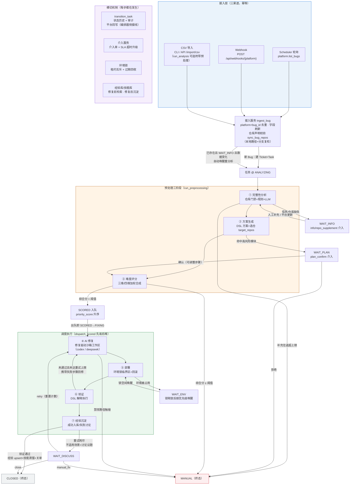

**要点**
- 接入三渠道共用 `ingest_bug` 幂等入口（`features/ingest/ingestion.py`）：新 Bug 建 `BugTicket + Task` 并写 `DISCOVERED → ANALYZING` 历史；已存在则刷新字段，`WAIT_INFO` 且数据变化时自动唤醒。
- 预处理由 `Orchestrator.run_preprocessing` 推进，评分恰好执行一次，准入后停在 `SCORED` 等调度器出队（不自动修复）。
- 平台回写挂在**编排器驱动**的状态迁移上（`status_map` 配置化），失败重试一次后告警，绝不阻塞主流程；调度器/API 侧迁移不回写，见 §15。

---

## 2. 任务状态机全景（全部合法迁移）

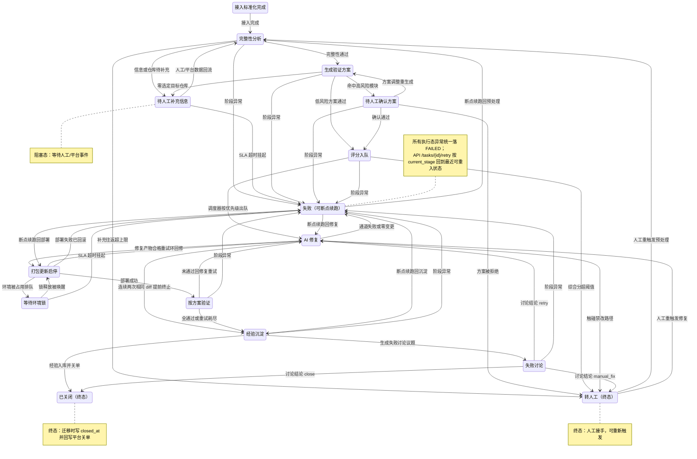

**要点**（对照 `common/core/state.py::LEGAL_TRANSITIONS`）
- `CANCELLED` 为终态，除 `CLOSED/CANCELLED` 外的任意状态（含终态 `MANUAL`）可经 API `POST /tasks/{id}/cancel` 进入（图中略，避免边爆炸）；cancel 同时关闭 pending 介入单并释放持有环境锁，见 §16。
- 断点续跑映射（`api/routes.py`）：`FAILED` 按 `current_stage` → `deploying/verifying→DEPLOYING`、`fixing→FIXING`、`learning→LEARNING`、其余→`ANALYZING`；`MANUAL→ANALYZING`；`WAIT_ENV→DEPLOYING`。
- 状态即断点：worker 只看当前状态路由 Stage，迁移历史完整落 `task_state_history` 可回放。

---

## 3. 调度器单轮流程（Scheduler.run_round）

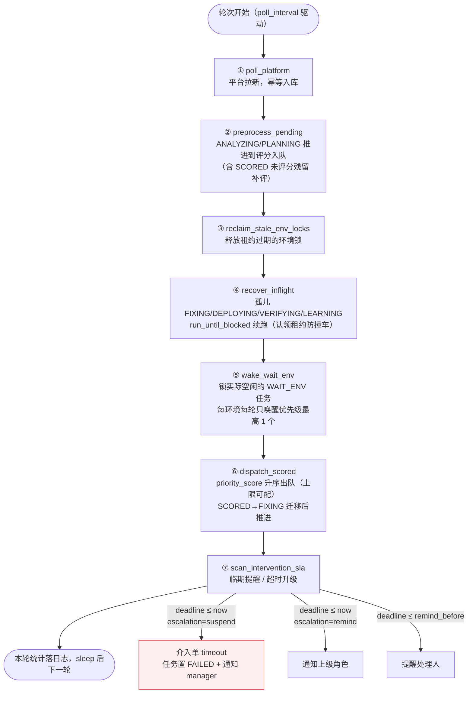

**要点**（`runtime/scheduler.py`）
- 顺序刻意安排：先回收锁再唤醒等锁任务，先补评分再出队。
- 单轮各步互相隔离（单任务异常仅记日志，不中断整轮）；`run_forever` 捕获 SIGINT/SIGTERM 优雅停止。

---

## 4. 编排器执行流程（Orchestrator.run_task）

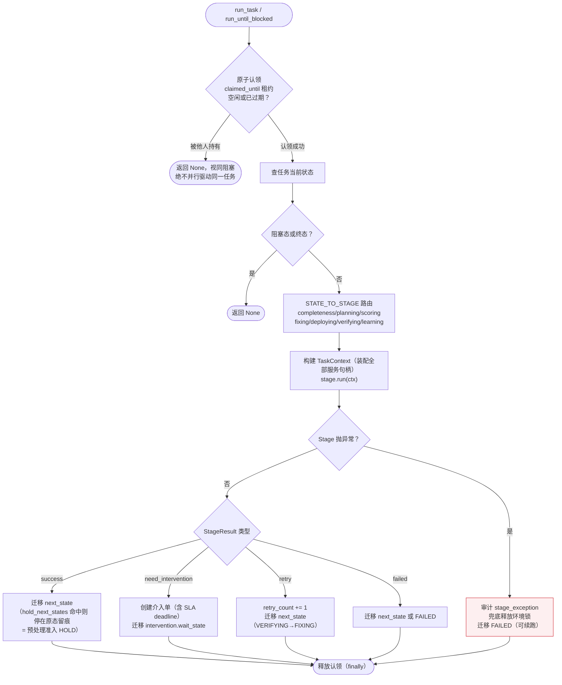

**要点**（`runtime/orchestrator.py`）
- 认领租约（`task_claim_lease_seconds=900`）保证多执行者（调度器/API/webhook/介入回写）并发安全。
- 四类结果 = 全部 Stage 的出口契约；`run_until_blocked` 循环单步直到阻塞/终态（上限 20 步防环）。
- `run_preprocessing` 只推 `ANALYZING/PLANNING`，`SCORED` 未评分时收尾补评一次——评分恰好执行一次。

---

## 5. 接入阶段（Ingest）

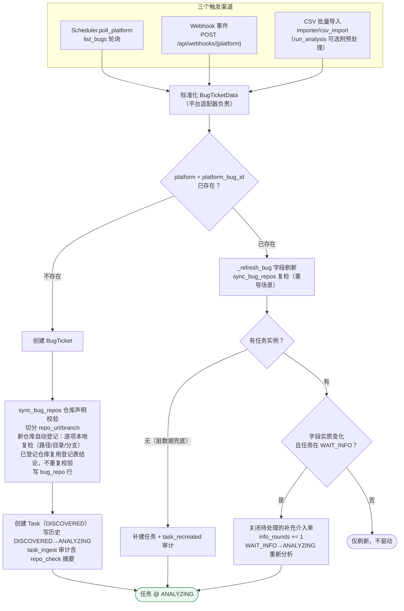

**要点**（`features/ingest/ingestion.py`、`repo_check.py`）
- 幂等以 `platform + platform_bug_id` 为键；重复导入不产生新任务。
- 仓库校验在接入时就完成（0 次 LLM 调用），不可用任务由完整性阶段门禁拦下——越早拦截越省成本。
- Webhook 只在任务停在 `ANALYZING` 时推进预处理：`SCORED` 任务不插队、in-flight 任务不被第二个执行者并发驱动。

---

## 6. 完整性分析（Completeness）

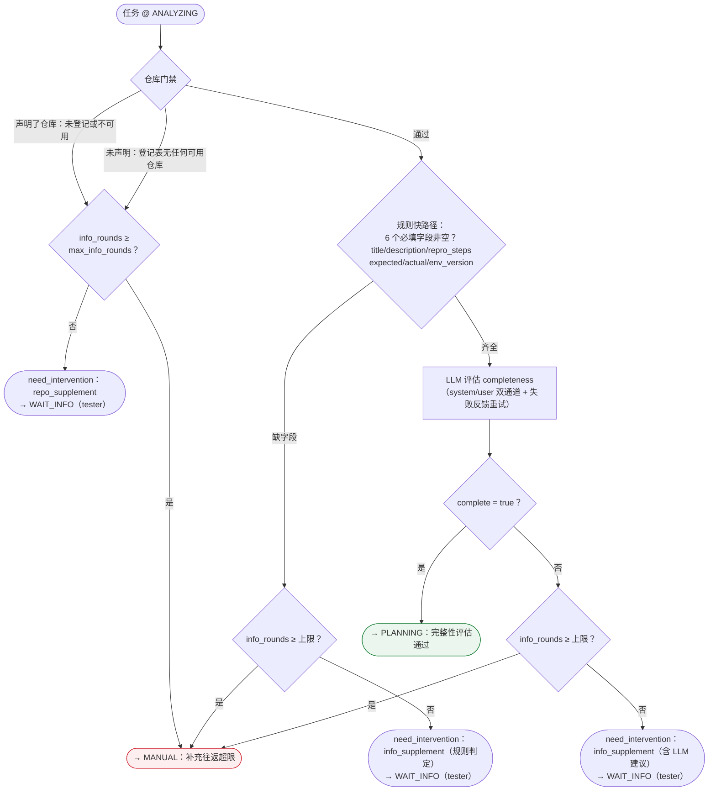

**要点**（`features/completeness/stage.py`）
- 纯门禁阶段（0~1 次 LLM 调用）：仓库画像与 Bug×仓库判定已移至 planning（Spec 02 §9 v3）。
- 三道闸门顺序：仓库门禁 → 规则快路径 → LLM 评估，逐级加深、逐级省钱。
- 信息补充与仓库补充共用 `info_rounds` 止损上限，防补充死循环。
- 唤醒回流：人工 `info_supplement/repo_supplement` 回写或平台数据更新都会把任务带回 `ANALYZING` 复检。

---

## 7. 方案生成（Planning，含目标仓库选定）

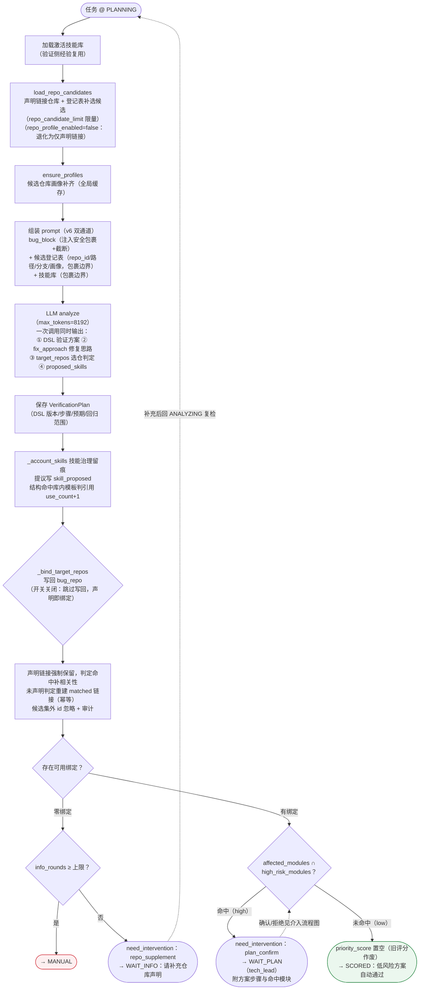

**要点**（`features/planning/stage.py`、`completeness/repo_profile.py`）
- 仓库信息在生成**之前**注入 prompt：候选登记表（含全局画像）是输入，`target_repos` 写回只是同一次判定的落库。
- 清 `priority_score` 仅发生在**低风险自动通过**路径（由 `run_preprocessing` 收尾步按未评分重评）；高风险经 `WAIT_PLAN` 确认回 `SCORED` **不清分**：首次进入无碍（收尾步补评），但已有旧评分的续跑场景（如 FAILED 重入规划）确认后会带旧分直接出队（当前代码行为）。
- `repo_profile_enabled=false` 降级：候选仅声明链接、不做 `target_repos` 写回，声明链接即绑定，下游回退基础仓库信息。
- `fix_approach` 是"提示而非约束"：下游修复以实际代码为准。

---

## 8. 难度评分（Scoring，双引擎）

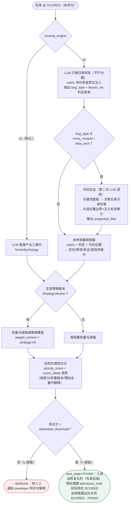

**要点**（`features/scoring/stage.py` + `v2.py`）
- 两引擎准入语义一致：综合分**严格小于**阈值才入队。
- v2 的"尺子在本地"：LLM 只判定类型与因子，分数由本地映射器按 rubric 常量产出，换评价标准不改模板只换 rubric。
- 策略版本（FR-SYS-02 自我优化）可在运行时覆盖权重与阈值，评分留痕携带权重版本。

---

## 9. AI 修复（Fixing）

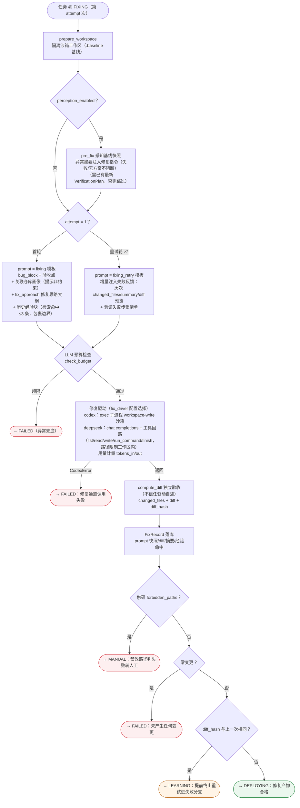

**要点**（`features/fixing/stage.py` + `codex.py` + `workspace.py`）
- 修复 agent 只在沙箱工作区内活动；对真实产物的验收靠独立 `compute_diff`，出口侧静态校验（11.2）拦禁改路径。
- 修复驱动可配置（`fix_driver`）：默认 `codex`（exec 子进程，CLI+鉴权预检）；`deepseek` 为同接口第二驱动（OpenAI 兼容 API + function calling 工具回路，预检查 API Key 配置，工厂见 `features/fixing/driver.py`）。
- 重试反馈回路（11.5）：验证失败步骤 + 历史尝试摘要结构化注入，控制 token；连续两次相同 diff 提前止损。
- 经验复用（FR-MEM-01）：命中条目注入并累计命中次数，作为二阶外部数据包裹边界。

---

## 10. 部署（Deploying，环境锁临界区）

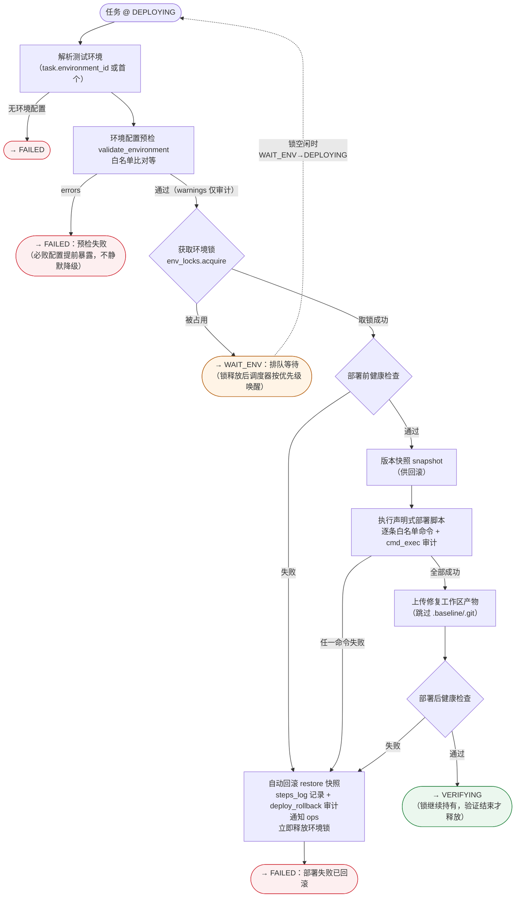

**要点**（`features/deploying/stage.py`）
- 部署+验证是一个临界区：锁从 DEPLOYING 取得，VERIFYING 的 `finally` 释放；部署失败立即释放。
- 任何一步失败自动回滚到修复前快照并告警（FR-REG-02）；worker 崩溃由调度器租约过期回收兜底。

---

## 11. 验证（Verifying，DSL 解释执行 + 重试环）

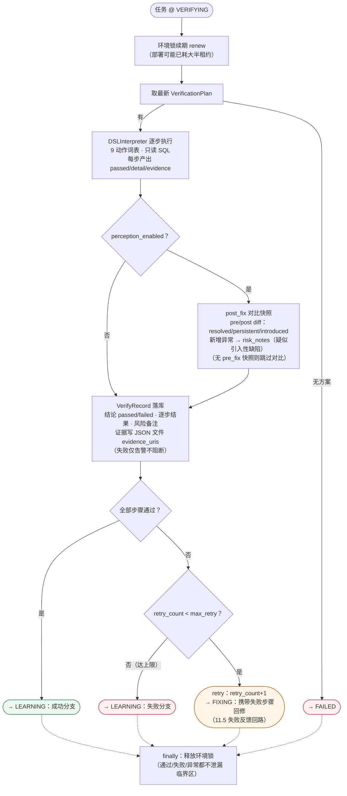

**要点**（`features/verifying/stage.py` + `common/dsl/`）
- 验证即执行 planning 产出的 DSL 方案，证据链逐步落盘可回溯。
- 重试环：VERIFYING 失败 → FIXING（retry 结果类型，Orchestrator 统一计数）→ 再部署再验证，直到通过或耗尽 `max_retry`。

---

## 12. 经验沉淀（Learning，成功/失败双分支）

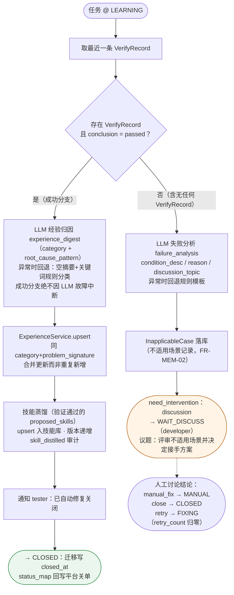

**要点**（`features/learning/stage.py`）
- 经验回流闭环：修复前检索复用（fixing）↔ 修复后沉淀（learning），技能库 = 验证侧经验库（planning 注入 + 学习蒸馏）。
- 两个 LLM 归纳调用都有规则回退路径，学习阶段本身不产生新的失败分支。

---

## 13. 人工介入生命周期（HITL + SLA）

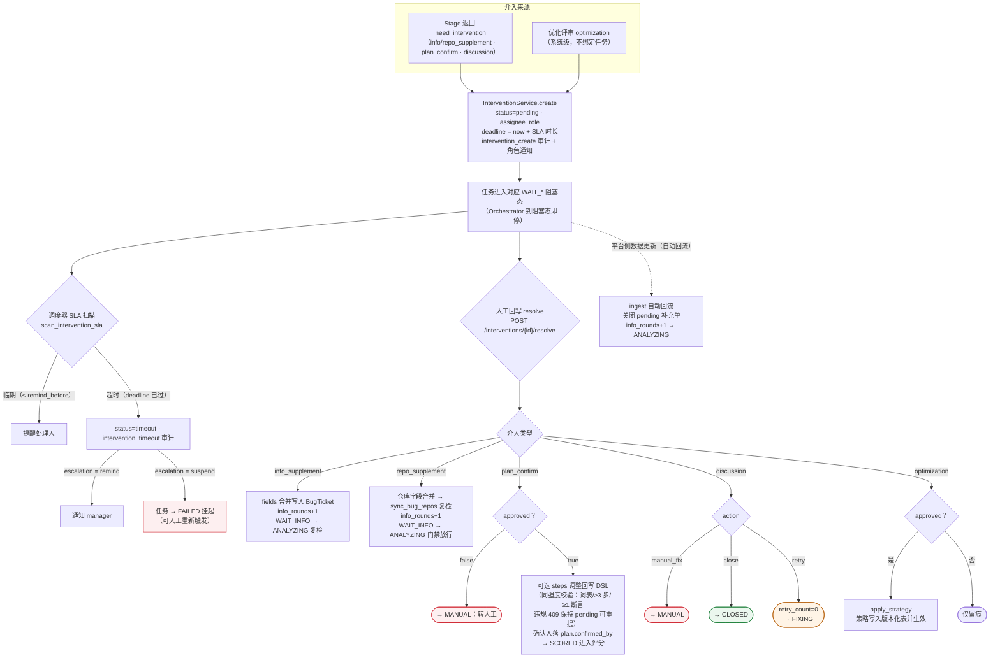

**要点**（`features/intervention/service.py`、`scheduler.scan_intervention_sla`）
- 介入单是 HITL 的唯一载体：创建即阻塞任务，回写即续跑——不同类型映射到不同的续跑状态。
- API resolve 构造的 InterventionService 未挂平台回写钩子：resolve 触发的迁移（含讨论 close 关单）不做平台状态回写，见 §15。
- 默认角色：info/repo_supplement→tester，plan_confirm→tech_lead，discussion→developer。
- SLA 是调度器职责（非定时器）：临期提醒、超时按配置 `remind/suspend` 升级。

---

## 14. 环境锁生命周期（跨部署/验证/调度）

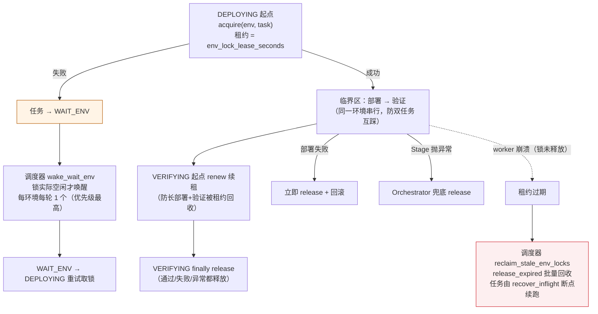

**要点**（`adapters/env/lock.py` + 调度器/编排器协作）
- 防死锁三保险：正常路径 finally 释放 → 异常路径编排器兜底 → 崩溃场景租约过期由调度器回收。
- 部署/验证 Stage 幂等可重入，回收后任务直接重跑即可。

---

## 15. 状态迁移留痕与平台回写（transition_task）

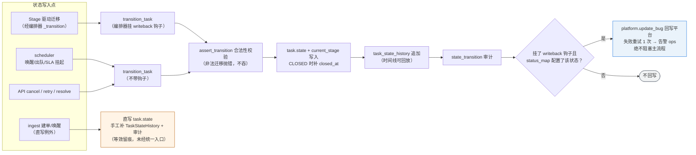

**要点**（`common/core/transitions.py`、`adapters/platform/writeback.py`）
- 平台回写是"尽力而为"副作用：映射可配置（如 `CLOSED → 平台已关闭`），失败只留痕告警；回写钩子**仅编排器侧接线**（`Orchestrator._transition`），scheduler 唤醒/出队/SLA 挂起与 API cancel/retry/resolve 经 `transition_task` 但不带钩子，不做平台回写。
- 当前唯一绕过统一入口的是 ingest：建单直写 state、唤醒先 `assert_transition` 后直写，均手工补历史与审计，留痕等效但未经 `transition_task`（按契约应收敛进统一入口）。

---

## 16. API 人工通道（cancel / retry）

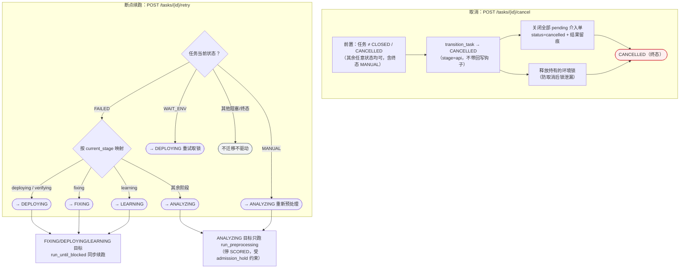

**要点**（`api/routes.py::cancel_task / retry_task`）
- cancel 是唯一能从终态 `MANUAL` 离开的口子；状态迁移、关闭介入单、释放环境锁同事务提交。
- retry 的口径是"回到 `current_stage` 对应的最近可重入状态"，与图 2 中 `FAILED` 的四条出边一一对应；`ANALYZING` 目标只跑预处理（停在 `SCORED`），不自动进修复。

---

## 附：图与代码对照表

| 图 | 阶段/机制 | 代码锚点 |
| --- | --- | --- |
| 1 总体流程 | 端到端 | `runtime/` + `features/` 全景 |
| 2 状态机 | 状态与迁移 | `common/core/state.py`、`common/core/transitions.py` |
| 3 调度器 | 单轮七步 | `runtime/scheduler.py::run_round` |
| 4 编排器 | 认领/路由/四类结果 | `runtime/orchestrator.py` |
| 5 接入 | 三渠道幂等 + 仓库校验 | `features/ingest/` |
| 6 完整性 | 门禁三道闸 | `features/completeness/stage.py` |
| 7 方案 | DSL + 选仓 | `features/planning/stage.py` |
| 8 评分 | 双引擎 + 准入 | `features/scoring/stage.py`、`v2.py` |
| 9 修复 | 修复驱动（codex/deepseek）+ 出口校验 | `features/fixing/stage.py` |
| 10 部署 | 锁临界区 + 回滚 | `features/deploying/stage.py` |
| 11 验证 | DSL 执行 + 重试环 | `features/verifying/stage.py`、`common/dsl/` |
| 12 学习 | 成功/失败双分支 | `features/learning/stage.py` |
| 13 介入 | HITL + SLA | `features/intervention/service.py` |
| 14 环境锁 | 租约互斥与回收 | `adapters/env/lock.py` |
| 15 回写 | 留痕与平台同步 | `common/core/transitions.py`、`adapters/platform/writeback.py` |
| 16 人工通道 | cancel / retry | `api/routes.py` |
